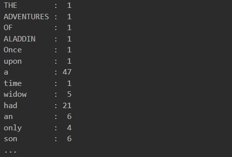

# Text Analysis

This program takes in a txt file and parses it for unique words. Input can be handled in a variety of ways to include standard input piping and multiple file intake using environment variables. The text is then analyzed word by word to track the frequency of its occurrence. Once the text has been analyzed and a data structure of words and the amount of their occurrence has been built, a output.txt is created and the data is written to it. 

